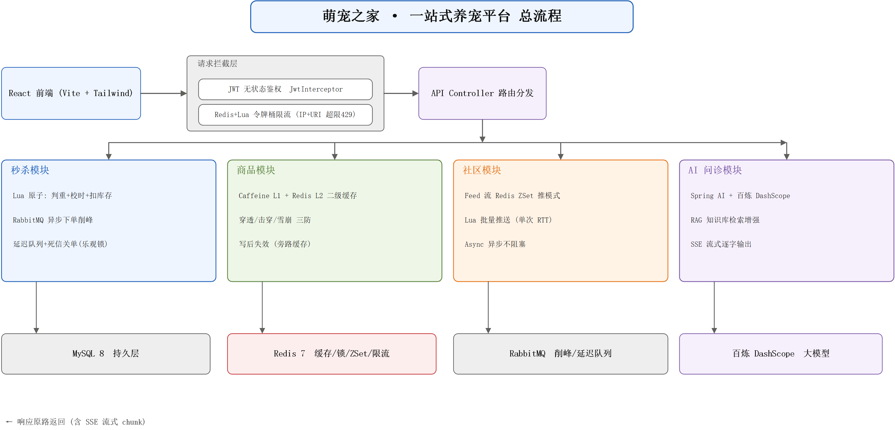
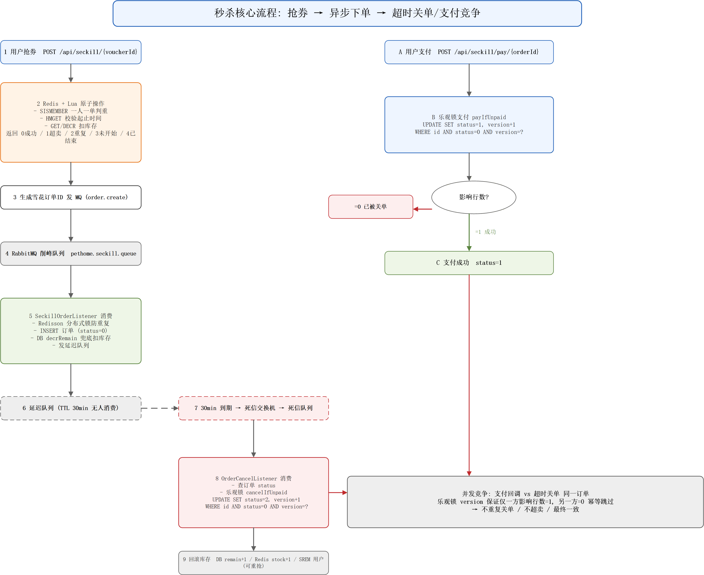
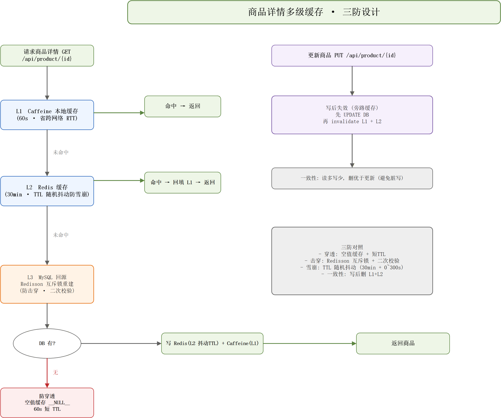
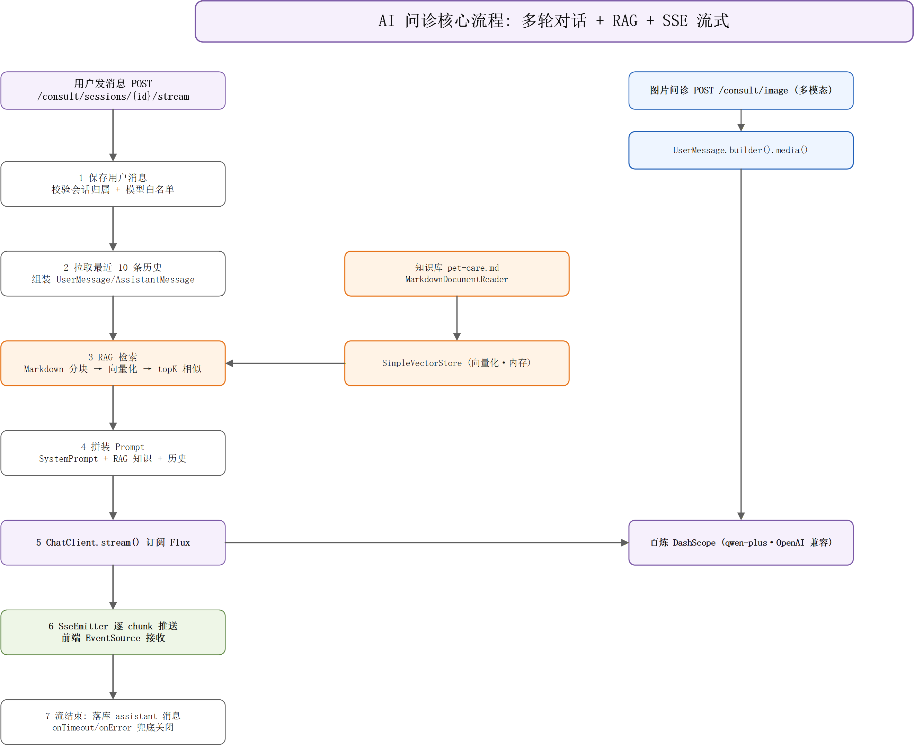

# 萌宠之家 · 一站式养宠平台

> Spring Boot 3 + Spring AI + React 全栈项目 · 落地秒杀、多级缓存、Feed 流、限流、AI 问诊等场景
全栈项目：Spring Boot + Spring AI 后端 + React 前端，落地秒杀、多级缓存、Feed 流、限流、AI 问诊等场景。商家资质、支付、物流、短信等需资质的功能做模拟。

---

## ✨ 核心特性

| # | 特性 | 关键技术 | 代码位置 | 流程图 |
|---|---|---|---|---|
| 1 | **秒杀不超卖** | Redis + Lua 原子「判重+校时+扣库存」+ RabbitMQ 异步下单削峰 + 三重幂等(Redisson锁/DB唯一键/Redis Set) | [SeckillService](backend/src/main/java/com/pethome/service/SeckillService.java) · [seckill.lua](backend/src/main/resources/lua/seckill.lua) · [SeckillOrderListener](backend/src/main/java/com/pethome/service/SeckillOrderListener.java) | [02-seckill](docs/visio/02-seckill.png) |
| 2 | **订单超时取消** | 延迟队列 + 死信交换机触发关单，乐观锁(`version`)兜底防并发重复关单/重复支付，回滚库存 | [OrderCancelListener](backend/src/main/java/com/pethome/service/OrderCancelListener.java) · [RabbitMQConfig](backend/src/main/java/com/pethome/config/RabbitMQConfig.java) | [02-seckill](docs/visio/02-seckill.png) |
| 3 | **热点数据多级缓存** | Caffeine L1(本地) + Redis L2 + MySQL，缓存**穿透(空值缓存+短TTL)/击穿(Redisson互斥锁+二次校验)/雪崩(TTL随机抖动)**三防 | [ProductService](backend/src/main/java/com/pethome/service/ProductService.java) · [CaffeineConfig](backend/src/main/java/com/pethome/config/CaffeineConfig.java) | [03-cache](docs/visio/03-cache.png) |
| 4 | **社区 Feed 流** | Redis ZSet 推模式时间线 + Lua 批量推送(单次 RTT) + @Async 不阻塞主流程 | [PostService](backend/src/main/java/com/pethome/service/PostService.java) · [feed_push.lua](backend/src/main/resources/lua/feed_push.lua) | [01-overall](docs/visio/01-overall.png) |
| 5 | **限流防刷** | Redis + Lua 令牌桶，按 IP+URI 维度原子取令牌，超限返回 429 | [RateLimitInterceptor](backend/src/main/java/com/pethome/interceptor/RateLimitInterceptor.java) · [ratelimit.lua](backend/src/main/resources/lua/ratelimit.lua) | [01-overall](docs/visio/01-overall.png) |
| 6 | **AI 针对性问诊** | Spring AI(百炼 DashScope) 多轮 + RAG 知识库 + 多模态 + SSE 流式；**会话绑定宠物档案，自动注入档案/体重趋势/健康记录作为上下文，给出针对性建议** | [ConsultController](backend/src/main/java/com/pethome/controller/ConsultController.java) · [PetProfileContextBuilder](backend/src/main/java/com/pethome/ai/PetProfileContextBuilder.java) · [RagService](backend/src/main/java/com/pethome/ai/RagService.java) | [04-ai](docs/visio/04-ai.png) |

### 实现说明

- **秒杀链路**：抢券接口只写 Redis + 发 MQ 即返回，订单落库异步消费——扛住瞬时流量；Lua 脚本把一人一单判重、起止时间校验、库存扣减压成一次原子操作，DB 端仅 `UPDATE ... WHERE remain>0` 兜底。**不超卖、不重复下单、不阻塞**。
- **订单超时取消**：下单后消息进 per-message TTL 延迟队列，到期无人消费→死信交换机→死信队列→消费者用 `UPDATE SET status=2 WHERE id AND status=0 AND version=?` 乐观锁关单，仅一方影响行数=1；支付端 `payIfUnpaid` 同样竞争 version，败方拿 0 行幂等跳过。**支付回调 vs 超时关单并发竞争，最终一致**。
- **多级缓存三防**：商品详情先 Caffeine(60s) 再 Redis(30min)，DB 几乎不被打到；穿透用空值缓存 `__NULL__`+短TTL，击穿用 Redisson 互斥锁重建+二次校验，雪崩用 TTL 随机抖动；写操作走旁路缓存失效(先更新DB再删L1+L2)。
- **AI 针对性问诊**：`consult_session` 绑定 `pet_id`，每次问诊由 `PetProfileContextBuilder` 自动把档案(物种/品种/年龄/体重/绝育/**过敏史/慢性病/禁忌药物**/脾气/应激/特殊照料) + 近期体重趋势 + 健康记录(疫苗/驱虫到期) 拼成结构化上下文注入 System Prompt，并明确要求**避开禁忌药物成分**、结合品种易发病给建议。

---

## 🗺️ 系统总流程



前端 → 请求拦截层(**JWT 鉴权** + **Redis+Lua 令牌桶限流**) → Controller 路由 → 四大业务模块(秒杀/商品/社区/AI问诊) → 中间件层(MySQL/Redis/RabbitMQ/百炼 DashScope)，响应原路返回(含 SSE 流式 chunk)。

---

## 🔬 核心模块流程图

### 秒杀 + 订单超时取消（特性 1、2）



左路：用户抢券 → Lua 原子判重+扣库存 → 发 MQ 异步下单 → 延迟队列(TTL 30min) → 死信交换机 → 关单消费者(乐观锁) → 回滚库存(DB remain+1 / Redis stock+1 / SREM 用户可重抢)。
右路：用户支付 → 乐观锁 `payIfUnpaid` → 「影响行数?」→ =1 成功 / =0 已被关单。两路通过 `version` 竞争同一订单，保证最终一致。

### 商品多级缓存 · 三防（特性 3）



L1 Caffeine → 命中返回；未命中 → L2 Redis → 命中回填 L1；未命中 → L3 MySQL(Redisson 互斥锁重建防击穿 + 二次校验) → 写回 L1+L2。DB 无数据走空值缓存防穿透，TTL 随机抖动防雪崩。写后失效(旁路缓存)保证一致性。

### AI 问诊 + RAG（特性 6）



用户消息 → 保存+校验归属 → 拉历史 → **RAG 检索(知识库 pet-care.md → SimpleVectorStore → topK)** → 拼装 Prompt(含**宠物档案上下文**) → ChatClient.stream() → SseEmitter 逐 chunk 推送 → 流结束落库。多模态分支(图片问诊)经 UserMessage.builder().media() 走百炼。

> 全部流程图源文件(`.vsdx` 可编辑)在 [docs/visio/](docs/visio/)，重绘脚本 [`.visio-tools/draw_diagrams.ps1`](.visio-tools/draw_diagrams.ps1)。

---

## 🛠️ 技术栈

**后端**：Spring Boot 3.3.5 · Spring AI 1.0(OpenAI 兼容→百炼 DashScope) · MyBatis-Plus 3.5.7 · MySQL 8 · Redis 7 + Redisson 3.34 · RabbitMQ 3.13 · Caffeine 3.1 · JWT(jjwt 0.12.6) · Hutool · Lombok · JDK 17

**前端**：React 18 · Vite 5 · Tailwind CSS 3 · React Router 7 · lucide-react · 原生 EventSource(SSE)

---

## 🚀 快速启动（Docker 一键全栈）

```bash
# 1. 起全部服务（MySQL/Redis/RabbitMQ + 后端 + 前端 nginx）
docker compose up -d --build
# 首次会自动建表(schema.sql)；AI/支付宝等密钥放 backend/.env，compose 自动加载

# 2. 首次导入种子数据（可选，否则页面空）
docker compose exec -T mysql mysql -uroot -proot123 pet_home < backend/seed_data.sql
docker compose exec -T mysql mysql -uroot -proot123 pet_home < backend/seed_services.sql

# 3. 访问
# 前端 http://localhost  （nginx 托管 + /api 反代到后端 8088）
# 后端 http://localhost/api
```

本地非 Docker 跑法（后端 `mvn spring-boot:run` + 前端 `npm run dev`）见 [backend/README.md](backend/README.md)、[frontend/README.md](frontend/README.md)；迁移/部署细节见 [MIGRATION.md](MIGRATION.md)。

---

## 📊 压测报告

### 测试环境

| 项目 | 规格 |
|------|------|
| 云服务器 | 腾讯云轻量应用服务器 |
| CPU | 4 核 |
| 内存 | 4 GB |
| 系统盘 | 40 GB |
| 公网 IPv4 | 115.159.203.20 |
| 操作系统 | Ubuntu 22.04 LTS |
| JDK | Eclipse Temurin 17 (Docker 内) |
| JVM 堆 | -Xms256m -Xmx1024m |
| Tomcat 线程池 | max=1000, min-spare=50, accept-count=1000 |

### 中间件版本

| 组件 | 版本 | 容器内端口 |
|------|------|-----------|
| MySQL | 8.0 | 3306 |
| Redis | 7-alpine | 6379 |
| RabbitMQ | 3.13-management | 5672 |
| 后端 (Spring Boot) | 3.3.5 | 8088 |

### 压测工具

全部测试脚本位于 [`bench/`](bench/) 目录，基于 JDK 17 单文件源码模式（无需编译，直接 `java Xxx.java` 运行）。每个脚本离线签发 JWT 后并发请求，统计 QPS / 成功率 / 错误码分布 / 延迟分位。

| 脚本 | 测试目标 | 用法示例 |
|------|---------|---------|
| [SeckillLoadTest](bench/SeckillLoadTest.java) | 秒杀高并发压测，统计 QPS 并验证零超卖/零重复 | `java bench/SeckillLoadTest.java --url http://localhost:8088/api --voucher 6 --users 1000 --concurrency 1000 --secret <JWT密钥>` |
| [CancelRaceTest](bench/CancelRaceTest.java) | 订单超时取消 vs 支付的乐观锁竞态验证 | `java bench/CancelRaceTest.java --voucher 6 --users 50 --pay-timeout-sec 5 --secret <JWT密钥>` |
| [CacheHitTest](bench/CacheHitTest.java) | 多级缓存 L1/L2/DB 命中率 + 穿透防护验证 | `java bench/CacheHitTest.java --url http://localhost:8088/api --requests 5000 --concurrency 200 --secret <JWT密钥>` |
| [RateLimitTest](bench/RateLimitTest.java) | 令牌桶限流 + 多 IP 隔离验证 | `java bench/RateLimitTest.java --url http://localhost:8088/api --path /seckill/list --burst 100 --multi-ip --secret <JWT密钥>` |
| [ConsultPersonalizeTest](bench/ConsultPersonalizeTest.java) | AI 问诊个性化验证（同问题不同宠物档案→不同回复） | `java bench/ConsultPersonalizeTest.java --url http://localhost:8088/api --pet-a 1 --pet-b 2 --question "狗狗最近不爱吃东西" --secret <JWT密钥>` |

### 压测方法

1. **环境准备**：`docker compose up -d --build` 起全栈，导入种子数据
2. **重置库存**：`docker exec pet-mysql mysql -uroot -proot123 pet_home -e "UPDATE seckill_voucher SET total=2000, remain=2000 WHERE id=6; DELETE FROM seckill_order WHERE voucher_id=6;"` + `docker exec pet-redis redis-cli SET seckill:stock:6 2000` + `DEL seckill:user:6`
3. **JVM 预热**：先跑一轮小流量让 JIT 编译热点代码
4. **正式压测**：在云服务器上直接执行 `java bench/SeckillLoadTest.java ...`（直连后端 8088，不经过 nginx），避免网络成为瓶颈
5. **验证**：压测后查 `SELECT COUNT(*) FROM seckill_order WHERE voucher_id=6` 确认无超卖

### 秒杀压测结果

> 测试条件：voucher=6，1000 个不同用户，1000 并发，Tomcat 1000 线程，JVM 预热后直连后端

| 指标 | 数值 |
|------|------|
| 总请求数 | 1000 |
| 成功下单 | 1000 (100%) |
| 超卖 | 0 |
| 重复下单 | 0 |
| HTTP 错误 | 0 |
| 限流拦截 | 0 |
| **QPS** | **468** |
| 平均延迟 | ~2.1s |
| Redis Lua 执行耗时 | ~2ms/次 |

### 性能调优历程

| 调整项 | 调整前 QPS | 调整后 QPS | 说明 |
|--------|-----------|-----------|------|
| Tomcat 默认 200 线程 | 312 | — | 1000 并发时线程池打满，请求排队 |
| Tomcat 线程调至 1000 | — | 468 | 解除线程池瓶颈，QPS +50% |
| 经 nginx 反代 | 468 | 365 | nginx 增加一跳，QPS 下降约 22% |
| 经 SSH 隧道(本地→云) | 468 | 244 | 隧道加密 + 网络往返延迟 600ms |

### 瓶颈分析

- **硬天花板：Redis 单线程 Lua 执行**。每个秒杀请求需 1 次 Redis Lua 原子操作（判重+校时+扣库存），Redis 单线程模型下单实例 QPS 上限约 3000。4 核 CPU 在 468 QPS 时利用率未满载，并非瓶颈。
- **线程池是软瓶颈**：默认 200 线程在 1000 并发下排队，调至 1000 后解除。
- **网络是外部瓶颈**：经 nginx 反代或 SSH 隧道后 QPS 显著下降，压测应直连后端端口。

---

## 📡 主要接口（节选）

| 方法 | 路径 | 鉴权 | 说明 |
|---|---|---|---|
| POST | `/api/user/sms/{phone}` | 否 | 发送短信验证码（模拟 1234） |
| POST | `/api/user/login/phone` | 否 | 手机号验证码登录/注册，返回 JWT |
| GET/POST/PUT/DELETE | `/api/pet/**` | 是 | 宠物档案 CRUD（Redis 缓存） |
| GET | `/api/product/{id}` | 否 | 商品详情（Caffeine+Redis 二级缓存） |
| POST | `/api/seckill/{voucherId}` | 是 | 抢券（Lua 扣库存 + MQ 异步下单） |
| POST | `/api/seckill/pay/{orderId}` | 是 | 模拟支付（乐观锁） |
| POST | `/api/community/posts` | 是 | 发帖（推送粉丝 Feed） |
| GET | `/api/community/feed` | 是 | Feed 流（Redis ZSet） |
| GET | `/api/consult/sessions/{id}/stream` | 是 | AI 问诊 SSE 流式（含宠物档案上下文） |
| POST | `/api/consult/image` | 是 | 图片问诊（多模态） |

---

## 🎭 模拟点

| 真功能 | 模拟做法 |
|---|---|
| 短信验证码 | 固定 `1234`，写 Redis，控制台打印 |
| 支付 | `/seckill/pay/{orderId}` 直接乐观锁改订单状态为已支付 |
| 商家资质 | 不做审核 |
| 物流/保险/处方药 | 未做，前端 mock |
| 百炼 AI | API Key|

---

## 📁 目录结构

```
pet-platform/
├─ docker-compose.yml        # 全栈一键编排（5 服务）
├─ backend/                  # Spring Boot + Spring AI 后端 → backend/README.md
├─ frontend/                 # React + Vite + Tailwind 前端  → frontend/README.md
├─ bench/                    # 5 个 JDK 单文件压测脚本（秒杀/关单竞争/缓存命中/限流/AI个性化）
├─ docs/visio/               # 4 张 Visio 流程图(.vsdx/.png/.svg/.pdf) → docs/README.md
├─ .visio-tools/             # 流程图重绘脚本 draw_diagrams.ps1
├─ crawl_pets.js / generate_seed.*   # 爬虫 + 种子数据生成器
└─ MIGRATION.md              # 迁移/部署指南
```

---

